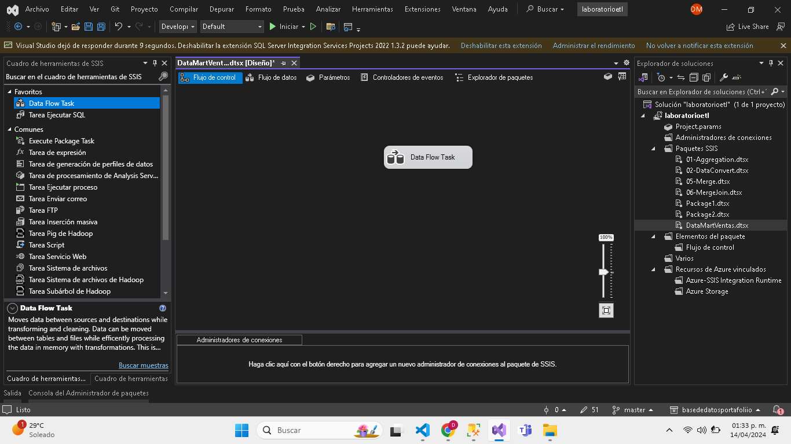
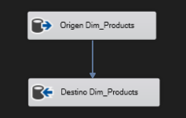
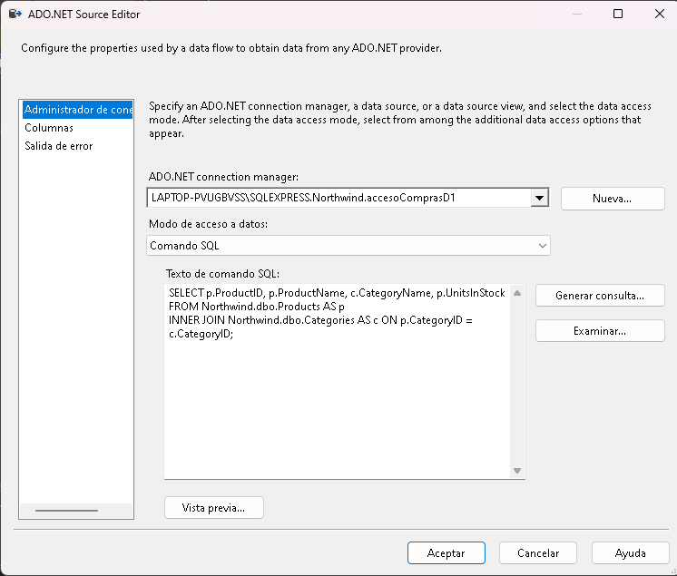
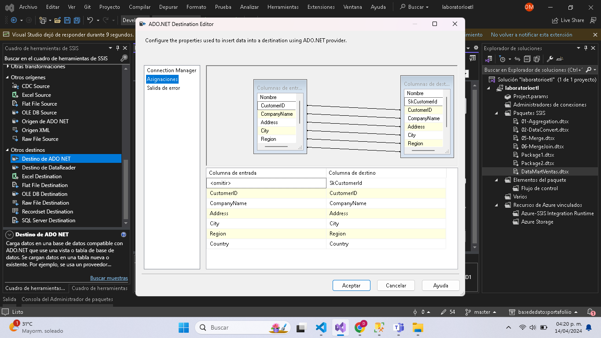
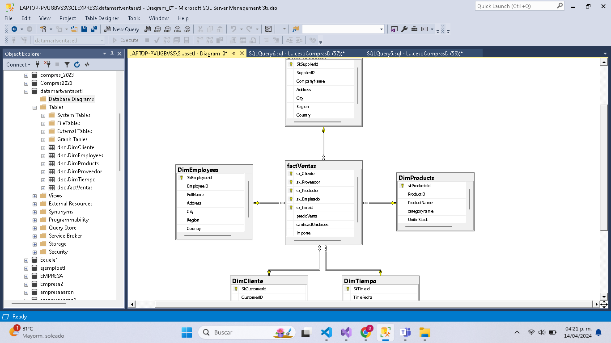
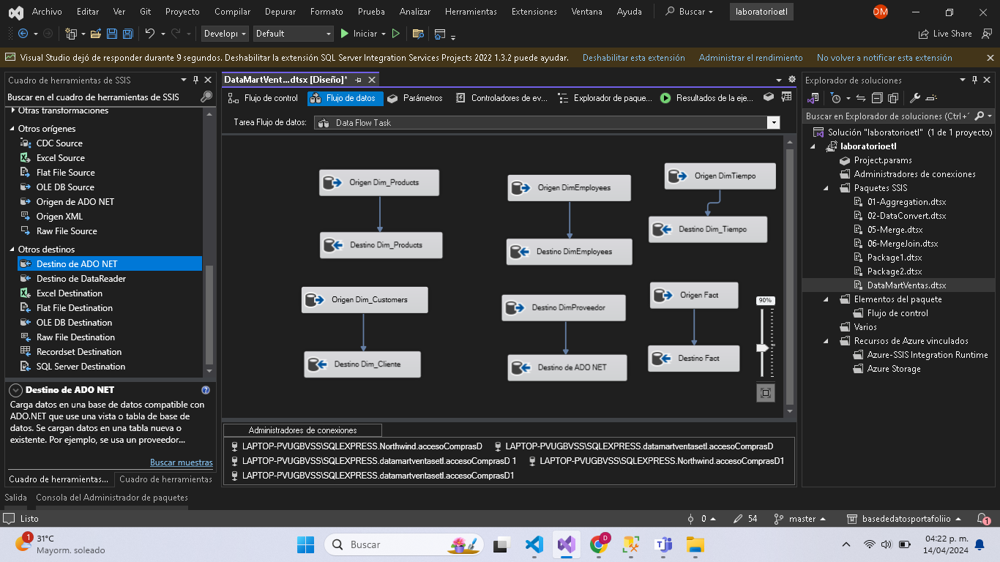
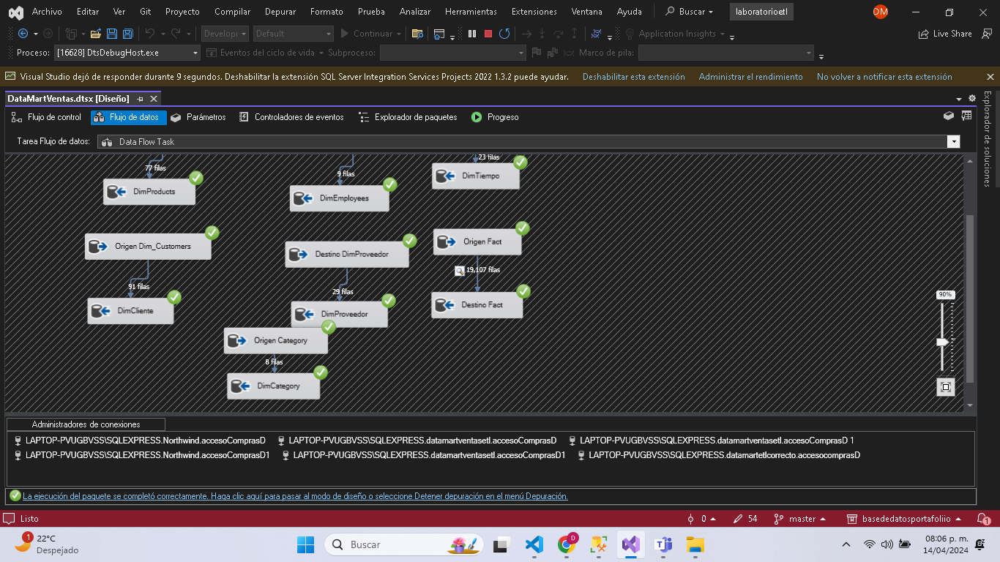
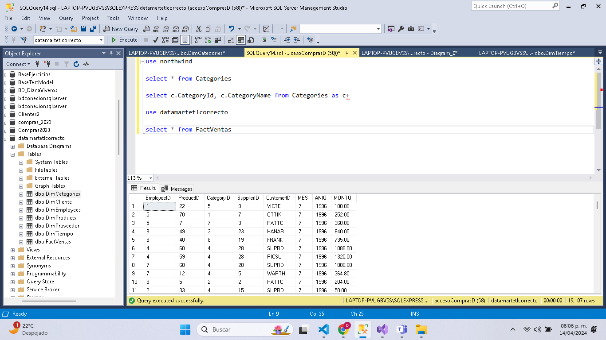
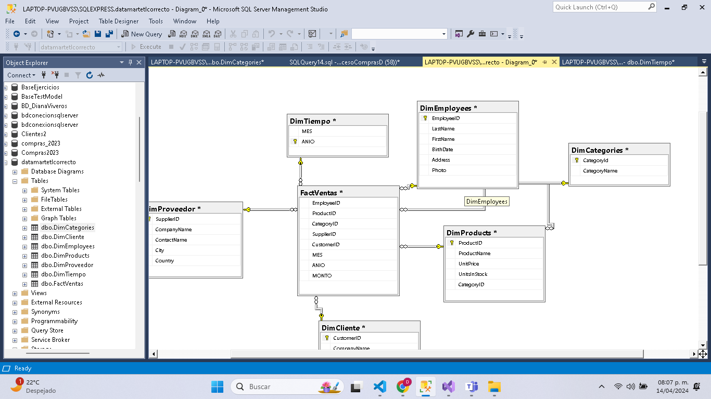

# Como hacer el etl
Lo primero que vamos a hacer es abrir nuestro visual studio, vamos a seleccionar un proyecto de integration services

Una vez abierto, crearemos un nuevo paquete ssis
Y en flujo de control, vamos a arrastrar una data flow task, o bien, tarea flujo de datos.



## Tabla Productos
### Origen
Daremos doble click para entrar a flujo de datos. Arrastraremos dos objetos, origen de ado net y destino de ado net.


Entraremos a origen de ado net y configuraremos el objeto de la siguiente forma



Script:

```sql
SELECT ProductID, ProductName, UnitPrice,UnitsInStock, Categories.CategoryID
FROM Products INNER JOIN Categories ON Products.CategoryID = Categories.CategoryID
ORDER BY ProductName ASC
);
```
Nota: es importante revisar que la configuración de las conexiones funciona correctamente para que todo
### Destino
Posteriormente enlazaremos el origen con el destino y entramos a la configuración de este

## Tabla Employees
Ahora una vez cerremos la ventana de la configuración, si nos dirigimos a nuestro sql. Podremos observar que la tabla fue creada con éxito
***
Podemos continuar con los siguiente componentes para realizar las tablas.
### Origen

```sql
SELECT e.[EmployeeID], e.Address, e.City, e.Region, e.Country, CONCAT(e.FirstName, ' ', e.LastName) AS FullName
FROM Northwind.dbo.Employees AS e;
```

### Destino

```sql
CREATE TABLE [dbo].[DimEmployees](
	SkEmployeeId int not null identity(1,1) primary key,
	[EmployeeID] [int]  NOT NULL,
	FullName nvarchar(50) not null,
	[Address] [nvarchar](60) NULL,
	[City] [nvarchar](15) NULL,
	[Region] [nvarchar](15) NULL,
	[Country] [nvarchar](15) NULL
	)
```

## Tabla DimCliente
### Origen
```sql
select c.CustomerID, c.CompanyName, c.Address, c.City, c.Region, c.Country
from Northwind.dbo.Customers AS c;
```

### Destino

```sql
CREATE TABLE [dbo].[DimCliente](
	SkCustomerId int not null identity(1,1) primary key,
	[CustomerID] [nchar](5) NOT NULL,
	[CompanyName] [nvarchar](40) NOT NULL,
	[Address] [nvarchar](60) NULL,
	[City] [nvarchar](15) NULL,
	[Region] [nvarchar](15) NULL,
	[Country] [nvarchar](15) NULL,
	)
```
***
## Tabla DimProveedor
### Origen
```sql
select s.SupplierID, s.CompanyName, s.Address, s.City, s.Region, s.Country
from Northwind.dbo.Suppliers AS s;
```
### Destino

```sql
CREATE TABLE [dbo].[DimProveedor](
	SkSupplierId int not null identity(1,1) primary key,
	[SupplierID] [int] NOT NULL,
	[CompanyName] [nvarchar](40) NOT NULL,
	[Address] [nvarchar](60) NULL,
	[City] [nvarchar](15) NULL,
	[Region] [nvarchar](15) NULL,
	[Country] [nvarchar](15) NULL,
	)
``` 
***
## Tabla DimTiempo
### Origen
```sql
SELECT o.OrderDate, YEAR(o.OrderDate) AS Anio,
    CASE 
        WHEN MONTH(o.OrderDate) BETWEEN 1 AND 3 THEN 1
        WHEN MONTH(o.OrderDate) BETWEEN 4 AND 6 THEN 2
        WHEN MONTH(o.OrderDate) BETWEEN 7 AND 9 THEN 3
        ELSE 4
    END AS Trimestre,
	MONTH(o.OrderDate) AS Mes
FROM Northwind.dbo.Orders AS o
```
### Destino

```sql
CREATE TABLE [dbo].[DimTiempo](
	SkTimeId int not null identity(1,1) primary key,
	TimeFecha date not null,
	TimeAño int not null,
	TimeTrimestre int not null,
	TimeMes int not null,
	)
``` 
***
## Tabla factVentas
### Origen
```sql
SELECT
    c.CustomerID AS sk_Cliente,
    p.SupplierID AS sk_Proveedor,
    od.ProductID AS sk_Producto,
    o.EmployeeID AS sk_Empleado,
    o.OrderDate AS sk_TimeId,
    (od.UnitPrice * od.Quantity) AS precioVenta,
    od.Quantity AS cantidadUnidades,
    (od.UnitPrice * od.Quantity) AS importe
FROM
    Customers c
JOIN
    Orders o ON c.CustomerID = o.CustomerID
JOIN
    [Order Details] od ON o.OrderID = od.OrderID
JOIN
    Products p ON od.ProductID = p.ProductID;
```
### Destino

```sql
CREATE TABLE  factVentas(
sk_Cliente int not null,
sk_Proveedor int not null,
sk_Producto int not null,
sk_Empleado int not null,
sk_timeid int not null,
precioVenta money not null,
cantidadUnidades int not null,
importe money not null

constraint pk_fact_ventas primary key(sk_Cliente,sk_Proveedor,sk_Producto,sk_Empleado,sk_TimeId),
constraint fk_fact_cliente foreign key (sk_Cliente) references DimCliente,
constraint fk_fact_proveedor foreign key (sk_Proveedor) references DimProveedor,
constraint fk_fact_producto foreign key (sk_Producto) references DimProducts,
constraint fk_fact_empleado foreign key (sk_Empleado) references DimEmployees,
constraint fk_fact_timeid foreign key (sk_TimeId) references DimTiempo,
)
``` 
***
# Notas importantes:

> [!NOTE]
> No olvidar revisar el mapeo de las tablas



> [!NOTE]
> Revisar las conexiones a las bases de datos correspondientes, northwind para origen y datamartventas para destino


# Resultado del diagrama



# Etl








